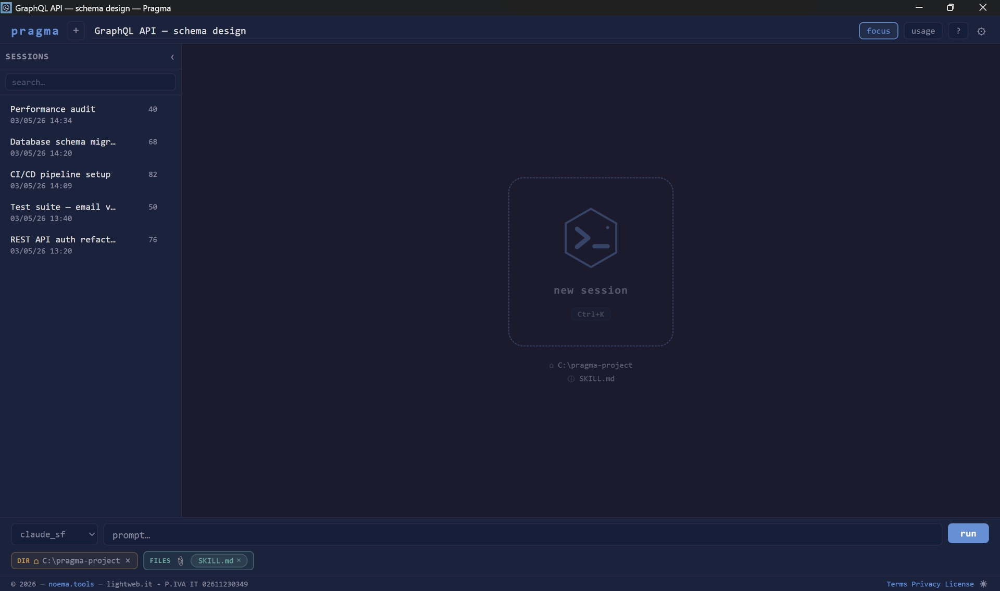
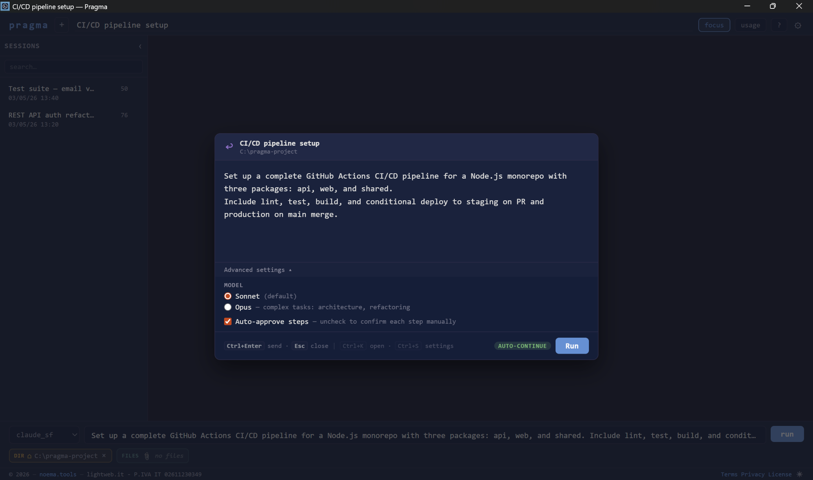
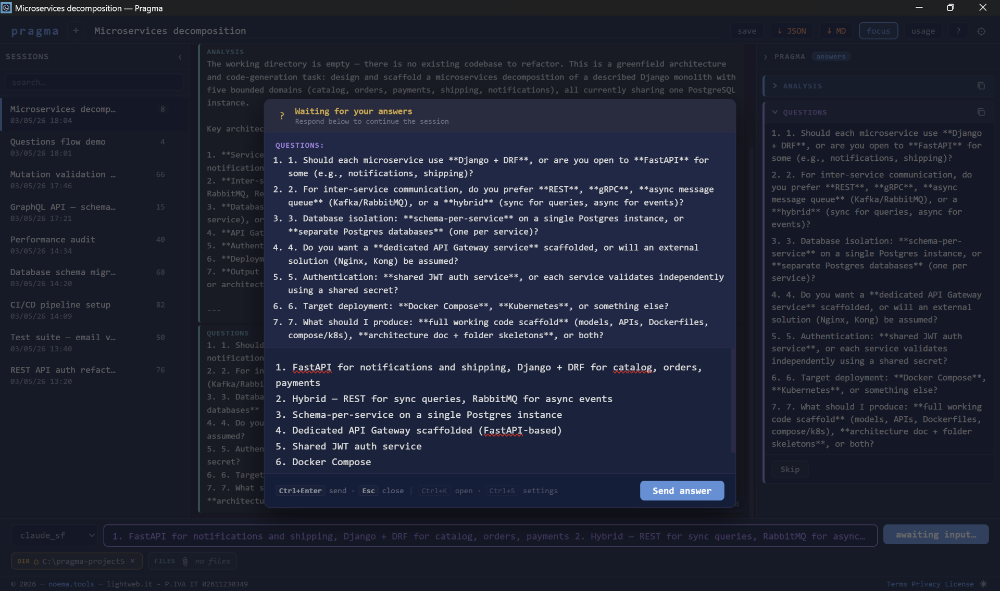
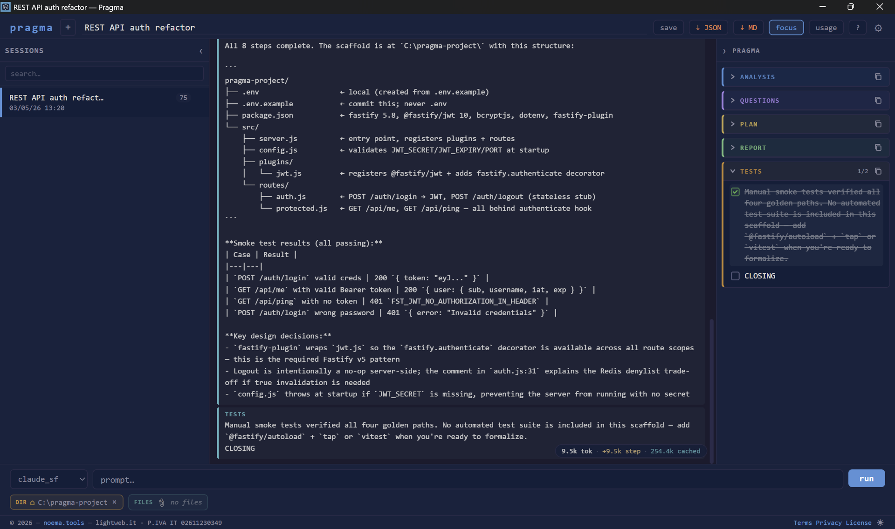
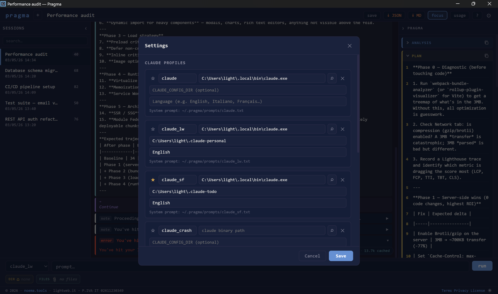
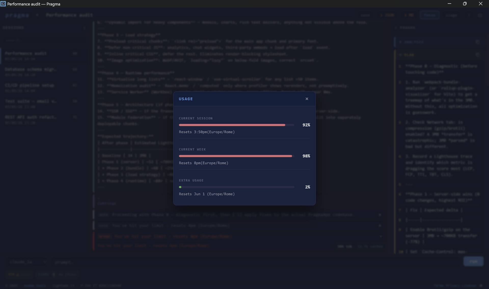
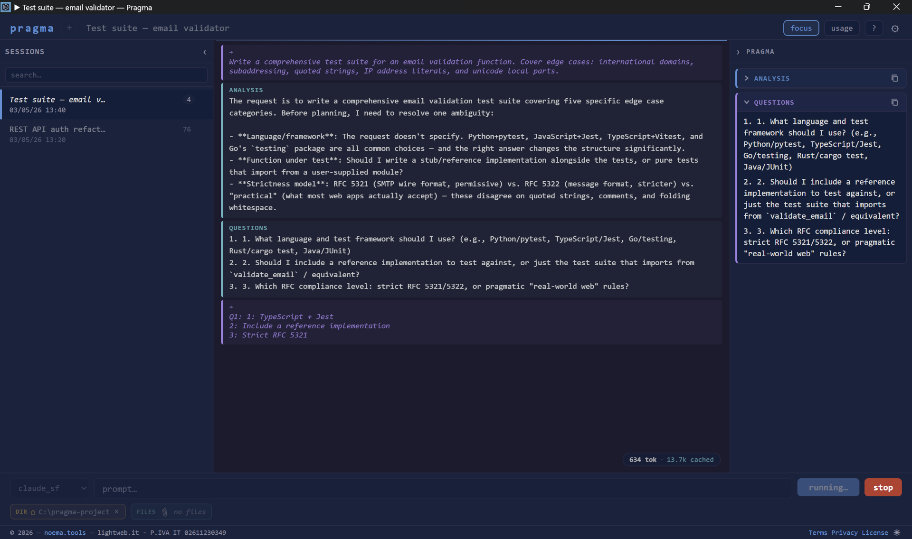

# Pragma

A local-first desktop frontend for Claude Code — visualize agent sessions as typed, navigable atoms.

> **Status: beta** — Windows and Linux supported. macOS planned.

---

## What it does

Claude Code produces a continuous stream of tool calls, diffs, and text. Pragma parses that stream in real time, classifies each event as a typed atom, and surfaces the relevant information in dedicated panels rather than a raw terminal scroll.

A session moves through up to six phases:

| Phase | Description |
|---|---|
| Analyzing | Claude examines the task and the working directory |
| Awaiting Answers | Claude asks clarifying questions before proceeding |
| Awaiting Approval | Claude presents a plan and waits for confirmation |
| Running | Tool calls, diffs, and file changes execute |
| Awaiting Confirmation | Claude requests a final go-ahead before closing |
| Complete | Session finished; export available |

---

## Features

- **Three-panel layout** — session list · structured pragma cards · raw atom stream
- **Typed atoms** — `FileTouch`, `Diff`, `ToolUse`, `Error`, `AgentNote`, `UserReply`, `PragmaEvent`
- **Structured cards** — AnalysisCard, QuestionsCard, PlanCard, TestsCard, ReportCard, ClosingCard
- **Multi-turn sessions** — resume a previous session and continue in context
- **Profiles** — multiple Claude Code installations with separate binary paths and config dirs
- **Model selection** — Sonnet (default) or Opus per session
- **File attachments** — files are copied into `{workingDir}/pragmadocs/` and passed to the agent
- **Working directory trust** — explicit user approval before any directory is used
- **Session history** — SQLite storage with full-text search
- **Export** — JSON or Markdown export from the UI or CLI
- **Focus mode** — filters noise, shows only structured pragma events
- **Dark / light theme**

---

## Screenshots


<p><em>Start screen — set working directory, attach files, choose Claude profile</em></p>


<p><em>Advanced prompt — thinker model, token limits, auto-continue, titles generation</em></p>


<p><em>Clarification flow — Pragma surfaces Claude's questions before execution starts</em></p>


<p><em>Session view — color-coded atom stream, analysis panel, live file tracking</em></p>


<p><em>Claude profiles — map named profiles to local .claude.env files</em></p>


<p><em>Usage panel — context window, current session and total token consumption</em></p>


<p><em>Focus mode — filter atom stream by type to cut noise during long sessions</em></p>

---

## Requirements

- [Claude Code CLI](https://claude.ai/code) installed and authenticated (`claude` binary in PATH or configured via profile)
- Windows 10+ or Linux (x86_64)

---

## Download

Pre-built binaries are available at **[noema.tools/download](https://noema.tools/download)**.

SHA-256 checksums are published alongside each release on the [GitHub Releases](https://github.com/lightwebit/pragma/releases) page.

To build from source, see [Building](#building).

---

## Building

Prerequisites:

- [Rust](https://rustup.rs) stable toolchain
- [Node.js](https://nodejs.org) v22
- [Tauri CLI v2](https://tauri.app/start/prerequisites/) — `cargo install tauri-cli --version "^2"`

```bash
# Install frontend dependencies
npm install

# Development (hot-reload)
npm run tauri:dev

# Production build — output in src-tauri/target/release/bundle/
npm run tauri:build
```

Refer to the [Tauri documentation](https://tauri.app/start/) for platform-specific build dependencies (WebKit on Linux, etc.).

---

## Data directory

Pragma stores all runtime data in `~/.pragma/`:

| Path | Contents |
|---|---|
| `~/.pragma/pragma.db` | Session history, atoms, full-text index |
| `~/.pragma/settings.json` | App settings and profiles |
| `~/.pragma/trusted_dirs.json` | User-approved working directories |
| `~/.pragma/prompts/<label>.txt` | External prompt files |

---

## Architecture

| Layer | Technology |
|---|---|
| Desktop shell | [Tauri v2](https://tauri.app) |
| Backend | Rust (stable) |
| Frontend | Vue 3 + Pinia + Vite + TypeScript |
| Storage | SQLite (WAL + FTS5) via `rusqlite` |
| Parser | `pragma-parser` (internal Rust crate) |
| CLI wrapper | `pragma-cli` (internal Rust crate) |

Data flow:

```
Claude Code (local process)
  ↓ structured JSON stream (stdout)
Pragma backend — Rust parser
  ↓ typed atoms via Tauri IPC
Pragma UI — Vue 3
  ↓ session storage
SQLite database (local device only)
```

---

## Project structure

```
pragma/
├── pragma-parser/      # Rust crate — parses agent stdout into typed atoms
├── pragma-cli/         # Rust crate — CLI wrapper binary
├── src-tauri/          # Tauri backend (Rust) — Tauri commands, IPC, storage
├── src/                # Vue 3 frontend — App.vue, components, Pinia store
├── docs/               # Technical documentation
└── Cargo.toml          # Workspace root
```

---

## Security model and `--dangerously-skip-permissions`

Pragma automatically passes `--dangerously-skip-permissions` to Claude Code on every session. This flag disables Claude Code's built-in tool-call confirmation prompts, which is required for unattended agent execution inside the Pragma UI.

**What this means:** Claude Code will execute file writes, shell commands, and other tool calls without asking for confirmation on each step. Pragma replaces that confirmation flow with its own approve/stop controls in the UI.

**What to do:** only point Pragma at working directories you own and trust. Pragma records every approved directory in `~/.pragma/trusted_dirs.json`.

---

## Privacy

Pragma processes all data locally. No telemetry, no analytics, no external connections.

Full details: [noema.tools/legal/privacy-pragma](https://noema.tools/legal/privacy-pragma)

---

## License

MIT — see [LICENSE](./LICENSE).

Pragma is not affiliated with Anthropic. Claude Code is a product of Anthropic, PBC.

---

## Part of noema.tools

Pragma is one of the tools in the [noema.tools](https://noema.tools) ecosystem.
